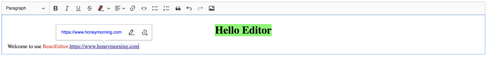

# react-ckeditor-classic

react-ckeditor-classic



## Usage

```bash
yarn add react-ckeditor-classic
```

```jsx
import ReactEditor from 'react-ckeditor-classic';

<ReactEditor
  data='Hello Editor!'
  config={{uploadUrl: '/your/api/image/upload/url'}}
  onChange={e => console.log(e)}
/>
```

## LICENSE [LGPL-3.0](./LICENSE)
